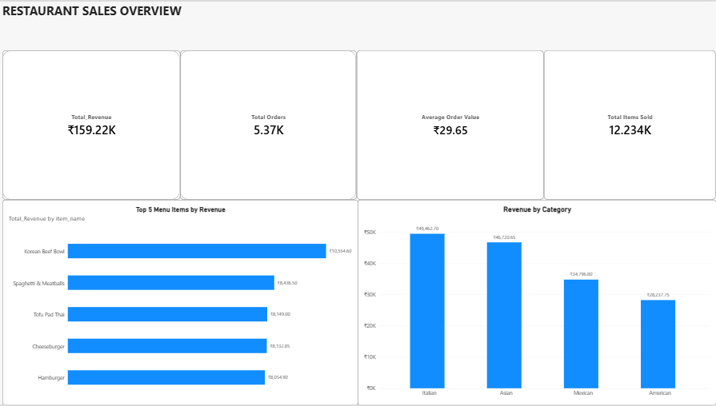
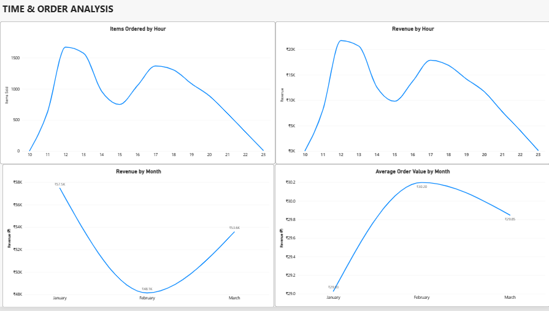
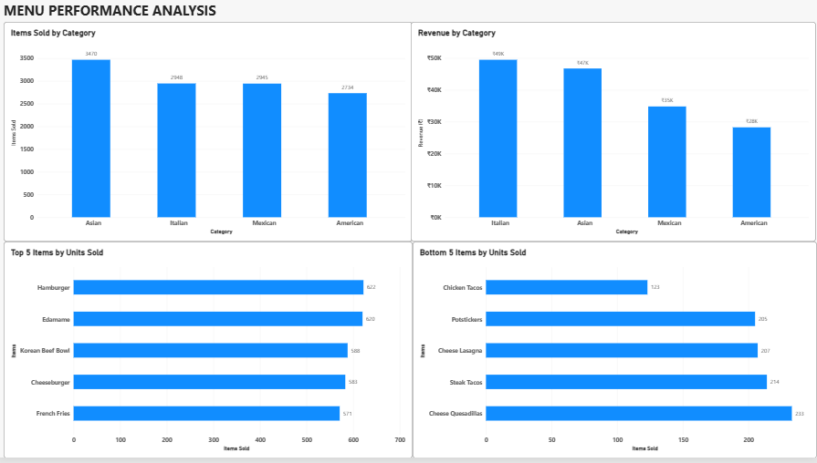

# Restaurant Orders Analysis

An end-to-end restaurant sales analysis project using **Microsoft Excel and Power BI** to analyze sales performance, ordering patterns, menu performance, and category-level revenue.

## 📊 Project Overview

This project analyzes a quarter of restaurant order data from a fictional international cuisine restaurant.

The analysis focuses on:

- Revenue and order performance
- Average Order Value (AOV)
- Ordering patterns by hour and month
- Revenue contribution by cuisine category
- Best-selling menu items
- Lowest-selling menu items
- Data quality and missing item IDs

## 🛠️ Tools & Technologies

- **Microsoft Excel** – Data cleaning, lookup/formula-based analysis, calculations and dashboard
- **Power BI** – Interactive dashboard and data visualization
- **DAX** – Measures and calculations
- **Power Query** – Data transformation and date cleaning

## 📁 Project Files

- `Restaurant_Orders_Dashboard.pbix` – Final Power BI dashboard
- `Restaurant_Analysis.xlsx` – Excel analysis workbook
- `Screenshots/` – Dashboard screenshots

## 📈 Power BI Dashboard

The Power BI report contains three analytical pages:

### 1. Restaurant Sales Overview

Provides a high-level view of:

- Total Revenue
- Total Orders
- Average Order Value
- Total Items Sold
- Top 5 Menu Items by Revenue
- Revenue by Category

### 2. Time & Order Analysis

Analyzes:

- Items Ordered by Hour
- Revenue by Hour
- Revenue by Month
- Average Order Value by Month

### 3. Menu Performance Analysis

Analyzes:

- Items Sold by Category
- Revenue by Category
- Top 5 Items by Units Sold
- Bottom 5 Items by Units Sold

## 🖼️ Dashboard Preview

### Restaurant Sales Overview

### Time & Order Analysis

### Menu Performance Analysis

## 🔎 Key Findings

- Total revenue generated: **₹159,217.90**
- Total orders: **5,370**
- Total items sold: **12,234**
- Average Order Value: approximately **₹29.65**
- Average items per order: approximately **2.28**
- **Italian** cuisine generated the highest category revenue.
- **Hamburger** was the highest-selling individual menu item by units.
- **Korean Beef Bowl** generated the highest revenue among individual menu items.
- Ordering activity was concentrated around the main lunch and dinner periods.

## 🧹 Data Preparation

The dataset required data-quality checks and transformation before analysis.

Key preparation steps included:

- Correcting inconsistent date interpretation
- Converting order dates into proper date values
- Handling missing (`NULL`) item IDs
- Linking order data with menu information
- Creating calculated measures for revenue, orders, AOV, and item volume
- Building a dedicated date table for time-based analysis

## 📌 Data Source

Dataset: **Maven Analytics – Restaurant Orders**

The dataset contains a quarter of restaurant order data from a fictional international cuisine restaurant.

Source: Maven Analytics

## 🎯 Business Questions

This project answers questions such as:

1. What is the restaurant's total revenue and order volume?
2. Which menu items generate the most revenue?
3. Which menu items sell the most units?
4. Which items have the weakest sales performance?
5. Which cuisine category generates the most revenue?
6. When are customers ordering the most?
7. How does Average Order Value change over time?

## 💡 Skills Demonstrated

- Data cleaning and validation
- Excel analysis
- Power Query
- Power BI dashboard development
- DAX measures
- Data modeling and relationships
- Time-series analysis
- KPI development
- Business-oriented data visualization
- Extracting actionable insights from transactional data
